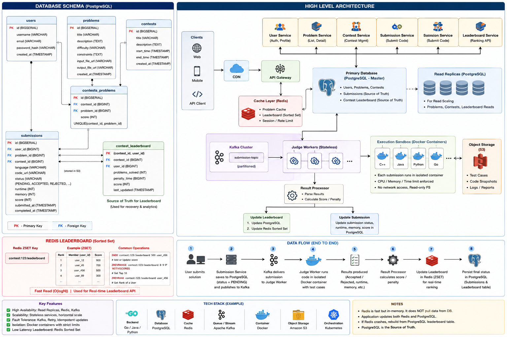
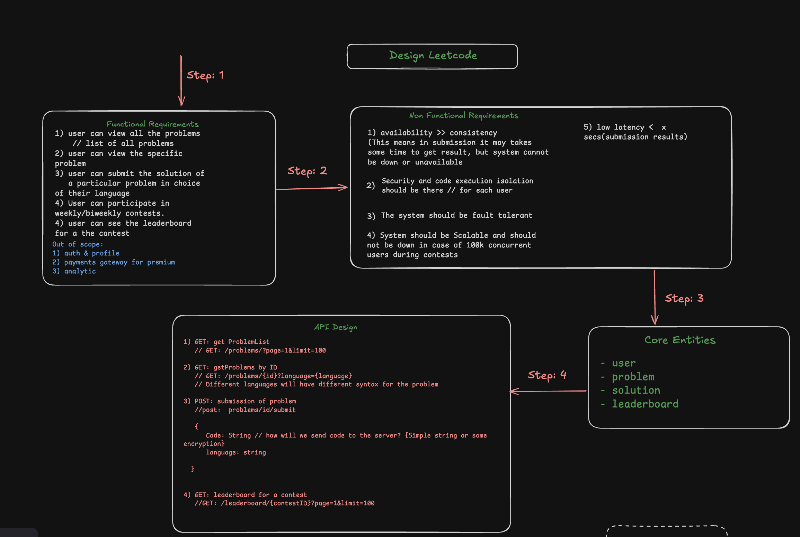
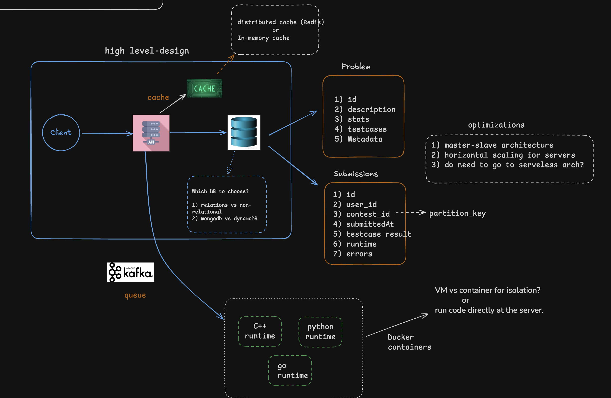

# 🚀 Online Coding Platform (LeetCode / HackerRank Style)

A scalable coding platform designed to support:

- 📚 Problem solving
- 🏆 Weekly/Biweekly contests
- ⚡ Real-time leaderboard updates
- 🔒 Secure code execution sandboxing
- 📈 100K+ concurrent users during contests
- 🛡 High availability and fault tolerance

---

# 📖 Functional Requirements

### Problems

- View all problems
- View a specific problem
- Multi-language problem descriptions
- Problem filtering and pagination

### Submissions

- Submit solutions in multiple languages
- View submission history
- View execution results

### Contests

- Participate in coding contests
- Contest ranking
- Real-time leaderboard

### Leaderboard

- Global contest ranking
- Rank by score and penalty
- Near real-time updates

---

# 🎯 Non-Functional Requirements

| Requirement | Priority |
|------------|----------|
| High Availability | Critical |
| Scalability | Critical |
| Secure Code Isolation | Critical |
| Fault Tolerance | Critical |
| Low Leaderboard Latency | High |
| Eventual Consistency | Acceptable |

---

# 🏗️ High Level Architecture



## Additional Architecture Diagrams





---

# 🔄 End-to-End Submission Flow

```text
User
 │
 ▼
Submission Service
 │
 ▼
PostgreSQL (PENDING)
 │
 ▼
Kafka Topic
 │
 ▼
Judge Workers
 │
 ▼
Execution Sandbox
 │
 ▼
Result Processor
 │
 ├── Update Submission Status
 │
 └── Update Leaderboard
        │
        ├── PostgreSQL
        └── Redis Sorted Set
```

---

# 🗄️ Database Design

## Users

```sql
users
-----
id
username
email
password_hash
created_at
```

## Problems

```sql
problems
--------
id
title
description
difficulty
constraints
input_file_url
output_file_url
created_at
```

---

## Contests

```sql
contests
--------
id
title
description
start_time
end_time
created_at
```

---

## Contest Problems

```sql
contest_problems
----------------
contest_id
problem_id
score
```

---

## Submissions

```sql
submissions
-----------
id
user_id
problem_id
contest_id
language
status
runtime
memory
score
submitted_at
completed_at
```

---

## Contest Leaderboard

```sql
contest_leaderboard
-------------------
contest_id
user_id
problems_solved
penalty_time
score
last_updated
```

---

# 💾 Why PostgreSQL?

## Advantages

✅ Strong consistency

✅ Relational data

✅ ACID transactions

✅ Complex ranking queries

✅ Mature ecosystem

Perfect for:

- Users
- Problems
- Contests
- Submissions
- Leaderboard persistence

---

# ⚡ Redis Usage

Redis acts as a fast-access layer.

## What is stored?

### Problem Cache

```text
problem:123
```

### Contest Metadata

```text
contest:456
```

### Session Cache

```text
session:user123
```

### Leaderboard

```text
contest:123:leaderboard
```

---

# 🏆 Redis Sorted Set (Leaderboard)

Redis stores:

```text
member + score
```

Example:

```text
contest:123:leaderboard

user_1 -> 900
user_2 -> 800
user_3 -> 500
```

---

## Update Score

```redis
ZADD contest:123:leaderboard 900 user_1
```

---

## Get Top 10

```redis
ZREVRANGE contest:123:leaderboard 0 9 WITHSCORES
```

---

## Get Rank

```redis
ZREVRANK contest:123:leaderboard user_1
```

---

# 🔥 Why Redis?

Without Redis:

```sql
SELECT
 user_id,
 score
FROM contest_leaderboard
ORDER BY score DESC
LIMIT 100;
```

Would execute repeatedly during contests.

With Redis:

```text
O(log n)
```

retrieval time.

---

# 📨 Kafka Architecture

Kafka decouples submission intake from code execution.

```text
Submission Service
        │
        ▼
     Kafka
        │
        ▼
 Judge Workers
```

Benefits:

- Backpressure handling
- Horizontal scaling
- Fault tolerance
- Event replay

---

# 🔒 Code Execution Isolation

Executing user code directly on servers is dangerous.

Example:

```cpp
while(true){}
```

or

```cpp
fork();
fork();
fork();
```

can exhaust resources.

---

# Sandbox Execution Options

## Option 1: Docker Containers ⭐

Most common choice.

```text
One Submission
      │
      ▼
 Docker Container
```

Advantages:

- Lightweight
- Fast startup
- Resource limits
- Easy orchestration

Example:

```bash
docker run \
  --memory=256m \
  --cpus=1 \
  --network=none \
  --read-only
```

---

## Option 2: gVisor (Google) ⭐⭐⭐

Google's container sandbox.

```text
Container
   │
gVisor
   │
Linux Kernel
```

Advantages:

- Stronger isolation
- Reduced kernel attack surface
- Used in Google Cloud Run

Recommended for production-grade judges.

---

## Option 3: Firecracker MicroVM (AWS) ⭐⭐⭐⭐

Used by:

- AWS Lambda
- AWS Fargate

Architecture:

```text
Submission
     │
     ▼
Micro VM
```

Advantages:

- VM-level isolation
- Extremely secure
- Millisecond startup

Best choice for enterprise-grade judges.

---

## Option 4: Kata Containers

Combines:

```text
Container
+
Virtual Machine
```

Advantages:

- Better security than Docker
- Easier than managing full VMs

---

## Option 5: Full Virtual Machines

```text
One User
   │
   ▼
Dedicated VM
```

Advantages:

- Maximum isolation

Disadvantages:

- Expensive
- Slow startup
- Poor scalability

Rarely used for online judges.

---

# Recommended Sandbox Strategy

### Startup / Medium Scale

```text
Docker
+
Resource Limits
```

---

### Large Scale

```text
Docker
+
gVisor
```

---

### LeetCode Scale

```text
Kafka
+
Judge Workers
+
Firecracker MicroVMs
```

---

# ☁️ Object Storage (S3)

Store large files outside PostgreSQL.

Examples:

### Test Cases

```text
input.txt
output.txt
```

### Submission Snapshots

```text
submission.cpp
```

### Logs

```text
execution.log
```

### Reports

```text
memory_report.json
```

---

# 📈 Scaling Strategy

## Application Layer

Horizontal scaling:

```text
             Load Balancer
                    │
      ┌─────────────┼─────────────┐
      │             │             │
   API-1         API-2         API-3
```

---

## Database Layer

### PostgreSQL Primary

```text
Write Operations
```

### Read Replicas

```text
Read Operations
```

Architecture:

```text
               Primary
                   │
       ┌───────────┼───────────┐
       │           │           │
   Replica1    Replica2    Replica3
```

---

# Fault Tolerance

## PostgreSQL

- Automated backups
- Read replicas
- Failover support

## Kafka

- Replication factor
- Multiple brokers

## Redis

- Redis Sentinel
- Redis Cluster

## Kubernetes

- Self-healing pods
- Auto-scaling

---

# Suggested Tech Stack

| Component | Technology |
|------------|------------|
| Backend | Go |
| API | REST / gRPC |
| Database | PostgreSQL |
| Cache | Redis |
| Queue | Kafka |
| Sandbox | Docker / gVisor |
| Object Storage | Amazon S3 |
| Container Orchestration | Kubernetes |
| Monitoring | Prometheus + Grafana |
| Logging | ELK Stack |

---

# Future Enhancements

- AI code review
- Collaborative coding rooms
- Plagiarism detection
- Custom contests
- Multi-region deployment
- WebSocket leaderboard updates
- Real-time contest notifications

---

# Final Architecture Summary

```text
Clients
   │
   ▼
API Gateway
   │
   ▼
Application Layer
   │
   ├── PostgreSQL
   ├── Redis
   ├── Kafka
   └── S3
            │
            ▼
      Judge Workers
            │
            ▼
 Docker / gVisor / Firecracker
```

**Source of Truth:** PostgreSQL

**Real-Time Leaderboard:** Redis Sorted Set

**Submission Pipeline:** Kafka

**Execution Isolation:** Docker / gVisor / Firecracker

**Scalability:** Kubernetes + Horizontal Scaling

**Availability:** Read Replicas + Redis + Kafka Replication